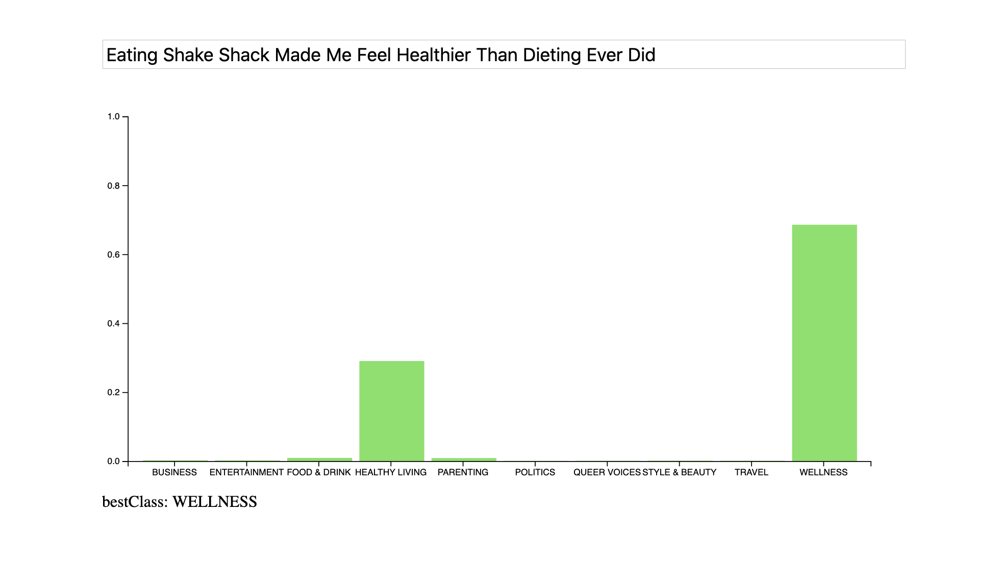

## Introduction
A very simple web client written in **Elm** that can do **NLP News Classification** using a Java **Spring Boot** power backend that was developed as part of a Java User Group presentation in Augsburg.



## Requirements

* NLP-Text-Classification Webservice v1.0.0 or newer
* Elm 0.19 or newer
* elm-live 4.0.0 or newer

You will need at least version **v1.0.0** of [NLP-Text-Classification Webservice](https://github.com/tobiassteidle/NLP-Text-Classification-Webservice/) that needs to be running locally on port 8080.

You can check your Elm requirements using these commands:
```sh
elm --version
elm-live --version
```

You will find install instructions for Elm [here](https://guide.elm-lang.org/install/elm.html).


Install the new version of **elm-live**:

```sh
# Globally for a user:
npm install --global elm elm-live@next

# …or locally for a project:
npm install --save-dev elm elm-live@next
```


## Start the Web Client

```sh
elm-live src/Main.elm --proxy-prefix=/nlpclass --proxy-host=http://localhost:8080/nlpclass
```
